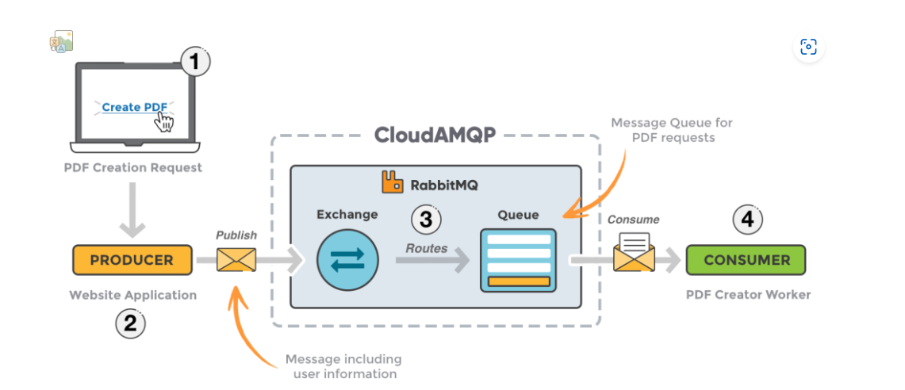

# RabbitMQ là gì?

RabbitMQ là một chương trình phần mềm trung gian giúp các ứng dụng, hệ thống hay server khác nhau có thể giao tiếp, trao đổi dữ liệu với nhau. Nhiệm vụ của RabbitMQ được hiểu đơn giản là: nhận message từ nhiều nguồn => lưu trữ, sắp xếp sao cho hợp lý => đẩy tới đích đến.

Là một message broker mã nguồn mở, có dung lượng nhẹ, dễ dàng triển khai trên rất nhiều hệ điều hành lẫn Cloud, vì thế RabbitMQ vô cùng được ưa chuộng và trở nên phổ biến trong thời gian qua.

Không chỉ những doanh nghiệp nhỏ muốn tiết kiệm chi phí sử dụng, ngay cả những doanh nghiệp lớn, họ cũng đang sử dụng RabbitMQ cho công việc.

## Message broker là gì?

Hiểu một cách đơn giản, message broker là một chương trình trung gian được phát triển nhằm để phục vụ nhu cầu giao tiếp giữa các ứng dụng khác nhau với nhau một cách dễ dàng. Bạn cũng có thể hiểu message broker là một chương trình phần mềm trung chuyển tin nhắn.

Chương trình message broker sẽ đảm nhận việc xác thực (validating), chuyển đổi (transforming) và định tuyến (routing) cho messages giữa các ứng dụng với nhau.

### Cách thức hoạt động của message broker

Producer (ứng dụng gửi) sẽ gửi một message đến một server process (trong bài là RabbitMQ) có khả năng sắp xếp, định tuyến, chuyển đổi, lưu trữ và gửi (delivery) đến consumer (ứng dụng nhận).

## Một số thuật ngữ liên quan đến RabbitMQ

- **Producer**: Ứng dụng/ chương trình gửi message.
- **Consumer**: Ứng dụng/ chương trình nhận message.
- **Queue**: Hoạt động lưu trữ các message.
- **Message**: Hay tin nhắn là thông tin được Producer truyền đến Consumer thông qua message broker (trong bài viết là RabbitMQ).
- **Connection**: Là kết nối TCP giữa ứng dụng/ chương trình và message broker.
- **Channel**: Là kết nối ảo trong một Connection là môi trường để thực hiện các hoạt động như publishing, consuming message từ queue.
- **Exchange**: Là nơi nhận message được publish từ Producer và đẩy chúng vào queue dựa vào quy tắc của từng loại Exchange.
- **Binding**: Là quy tắc – rule, Exchange có nhiệm vụ liên kết và routing message đến queue.
- **Routing key**: Một key mà Exchange dựa vào đó để quyết định cách để định tuyến message đến queue.
- **AMQP – Advanced Message Queuing Protocol**: Là một giao thức (protocol) truyền message được sử dụng trong RabbitMQ.
- **User**: Hay người dùng, mỗi người dùng sẽ có tài khoản, mật khẩu khác nhau và những quyền hạn nhất định được phân cụ thể trong RabbitMQ.
- **Virtual host (Vhost)**: Là một phương thức cho phép lưu trữ các ứng dụng khác nhau dùng chung RabbitMQ instance. User khác nhau sẽ có quyền khác nhau với các Vhost; Queue và Exchange sẽ chỉ tồn tại trong một Vhost.

## RabbitMQ có tính năng và lợi ích như thế nào?

### Asynchronous Messaging

RabbitMQ hỗ trợ rất nhiều giao thức message như: sắp xếp hàng đợi, gửi message, khả năng định tuyến hàng đợi linh hoạt và nhiều loại exchange khác.

### Developer Experience

Với mức độ linh hoạt của RabbitMQ, bạn có thể triển khai trên BOSH, Chef, Docker và cả Puppet. RabbitMQ không chỉ tương thích với ngôn ngữ Erlang “mẹ đẻ”, RabbitMQ còn có khả năng tương thích với hầu hết các ngôn ngữ lập trình thông dụng như: Java, PHP, JavaScript, Go, Ruby, .NET,…

### Distributed Deployment

Bạn có thể triển khai RabbitMQ dưới dạng các cluster có tính khả dụng cao và thông lượng lớn từ đó bạn có thể phát triển liên kết toàn cầu qua nhiều khu vực, lãnh thổ.

### Enterprise & Cloud Ready

Với những công nghệ xác thực, ủy quyền được phát triển dựa trên TLS và LDAP gia tăng độ bảo mật lên rất cao. RabbitMQ có dung lượng nhẹ và khả năng tương thích và phát triển một cách dễ dàng trên các public cloud cũng như private cloud.

### Management & Monitoring

Bạn hoàn toàn có thể sử dụng các HTTP-API, các công cụ dòng lệnh và cả công cụ được phát triển thân thiện với người dùng để quản lý, giám sát RabbitMQ một cách hiệu quả nhất.

### Tools & Plugins

RabbitMQ cung cấp rất nhiều tool và plugin được phát triển liên tục với khả năng như: tích hợp, khả năng đo lường và tương thích với các hệ thống khác của doanh nghiệp.

## RabbitMQ hoạt động ra sao?

### Ví dụ về cách RabbitMQ hoạt động

Bạn lên một trang web tạo CV online miễn phí, sau khi bạn điền hết thông tin và bạn gửi yêu cầu xuất một tệp CV dạng PDF. Tất nhiên, việc tạo CV và yêu cầu xuất file PDF ra không phải chỉ duy nhất bạn yêu cầu, nếu xử lý không khéo, server sẽ bị quá tải và nghẽn. Vì thế, các nhà nhà phát triển sẽ sử dụng RabbitMQ để lấy request và tạo hàng chờ. Cơ chế hoạt động lúc này như sau:

- Consumer lấy message từ hàng chờ và tạo file PDF; trong cùng lúc, một producer đang gửi thêm các message khác vào hàng chờ. Request có thể được tạo bởi ngôn ngữ này và xử lý bởi ngôn ngữ khác thông qua việc trao đổi bằng message, từ đó làm giảm sự ràng buộc giữa 2 đầu.

Tóm tắt lại, quá trình tạo file CV PDF online của bạn sẽ được RabbitMQ thực hiện như sau:

1. Bạn yêu cầu website tạo một file CV PDF.
2. Website sẽ tạo message đến RabbitMQ với các nội dung như Họ tên và email của bạn.
3. Một exchange sẽ đồng ý và xử lý message từ producer và routing message đó vào đúng hàng đợi tạo PDF.
4. Một worker xử lý PDF sẽ nhận task và tạo PDF giúp bạn.

## Các loại Exchange trong RabbitMQ

- **Direct exchange**: Message sẽ được truyền trực tiếp đến hàng đợi dựa trên routing key – khóa định tuyến. Ví dụ: nếu một hàng đợi exchange có binding key là `Tao_PDF`, message có routing key là `Tao_PDF` sẽ được đẩy vào hàng đợi của exchange đó.

- **Fanout exchange**: Fanout exchange sẽ đẩy message đến toàn bộ hàng đợi được gắn với exchange đó. Hiểu một cách đơn giản, bản copy của message sẽ được gửi tới tất cả các hàng đợi và bỏ qua routing key.

- **Topic exchange**: Topic exchange sẽ là một wildcard hay lá bài để gắn routing key với một routing pattern khi khai báo trong binding. Consumer có thể tự chọn những topic phù hợp với cú pháp sử dụng `*` hoặc `#`. Ví dụ: `Tao.*` hoặc `Tao.#` để đăng ký toàn bộ key bắt đầu bằng `Tao`.

- **Headers exchange**: Header exchange khá giống với cách thức hoạt động của Topic exchange. Tuy nhiên, header exchange sử dụng thuộc tính của các message để routing. Message đó sẽ hợp lệ nếu giá trị tiêu đề đúng với giá trị ràng buộc (giống như ví dụ của Topic exchange).

